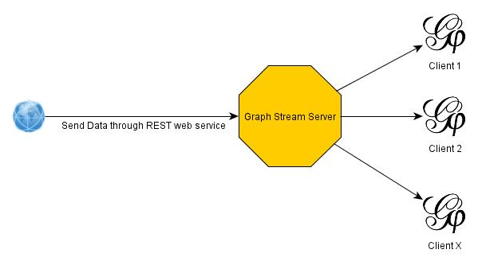
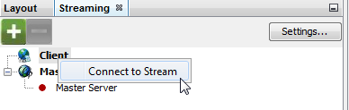
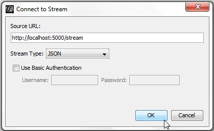
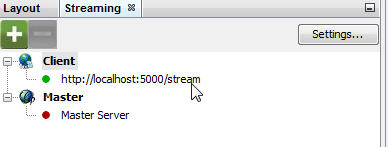

# Graph Stream Server
Enhancement of https://github.com/panisson/pygephi_graphstreaming to make a simple Graph Stream Server.

Main change is to use Flask Framework instead of the low-level Python to manage HTTP Streams.

When the server receive a stream event , it will broadcast this event to all current Gephi Client connected.  

# Requierments 

* Python
* See req.txt for libraries

# Install & Run

Git clone the project or Download it.

Run `python graphStreamServer.py`.

> The default configuration bind to 0.0.0.0:5000. The server should be accessible as :
> 
> - `http://localhost:5000/` : Good for test
> - `http://<yourIP>:5000/` : Good to share across same network
> - `http://<hostname>:5000/` : Good to share acress internet
>
> Adapt examples bellow to your situation.

# Subscribe in Gephi
> You already have the Graph Streaming Plug-in installed in Gephi.
> 
> You already started a Graph Stream Server on at ***http://localhost:5000/***

In the **Streaming** tab, click-right on **Client** and choose **Connect to Stream**.

On source Url, put **http://localhost:5000/stream** and click **Ok**.

On the**Streaming** tab, you should see your Url with a Green Point.

# Push Web Services

The server by itself isn't generating any data. It exposes Web Services that can be used to send graph data that will be broadcasted to all current listeners.

Because it's based on REST web service, there is no restriction about the language, as long as it can handle HTTP Request .

Full description of data format : [https://wiki.gephi.org/index.php/Graph_Streaming](https://wiki.gephi.org/index.php/Graph_Streaming)

## POST **`http://localhost:5000/<actionToPerform>`** 

This service is a wrapper of the `http://localhost:5000/action` service to automatically handle the action overhead directly on the service. It makes the data to send more accessible. 

* Url Parameter
	* `an` : **A**dd **N**ode
	* `cn` : **C**hange **N**ode
	* `dn` : **D**elete **N**ode
	* `ae` : **A**dd **E**dge
	* `ce` : **C**hange **E**dge
	* `de` : **D**elete **E**dge

Request Data :

    	{"<entityID>":
    		{
    			"<property1>":"<stringValue>",
    			"<property2>":<numericValue>,
    			[....]
    		}
    	}

## POST **`http://localhost:5000/action`**

This service is more *close* to the original streaming behaviour.

Request Data :

    {"<actionToPerform>":
		{"<entityID>":
			{
				"<property1>":"<stringValue>",
				"<property2>":<numericValue>,
				[....]
			}
		}
	}

# Just thinking
Endless possibilites of advanced Pub/Sub mechanism with Redis or RabbitMQ coupled with the Graph Stream Server (tested with Redis and works perfectly).

Possibility to plug it into a Web Socket / WAMP.ws mainly to dispatch to web browser.

Security enhancement, History when (re)connected, etc ... 

Did not perform any " *Scaling / Stress Test* ". Let's organise a worldwide test one day.